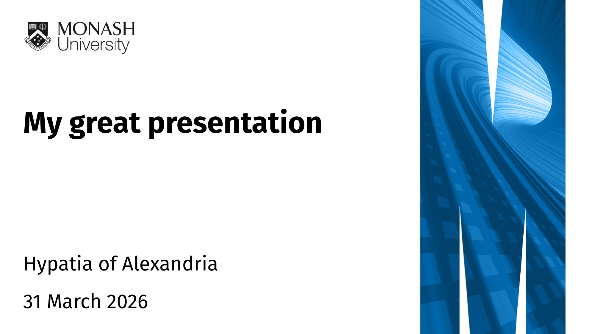
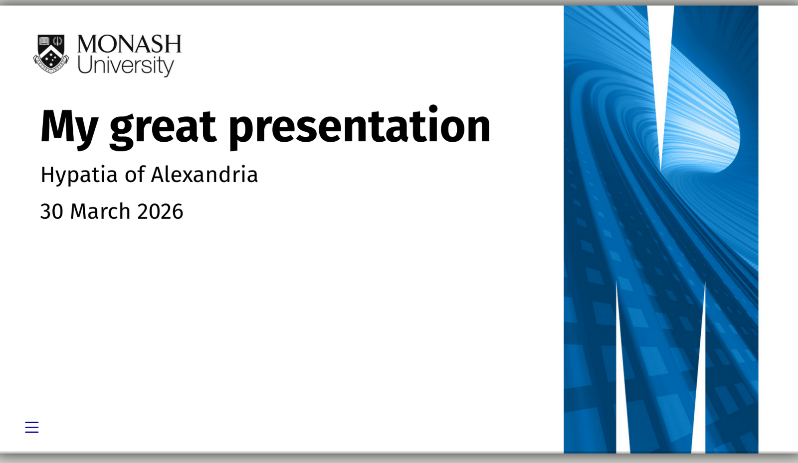

<!-- README.md is generated from README.qmd. Please edit that file -->

```{r}
#| include: false
# Create pdf and png version of template
library(tidyverse)
library(quarto)
library(magick)

# Render the template
quarto_render(
  input = "template.qmd",
  output_format = c("presentation-revealjs+letterbox", "presentation-typst"),
  metadata = list(`bg-path` = "_extensions/presentation/_images/background/")
)
# Convert rendered PDF to PNG (first page only)
image_read_pdf("template.pdf", density = 200)[1] |>
  #image_montage(geometry = "x600+15+15", tile = 1, bg = "grey92", shadow = TRUE) |>
  image_convert(format = "png") |>
  image_write("examples/pdftemplate.png")
# Convert rendered html to png
#pagedown::chrome_print("template.html", "examples/htmltemplate.png", format="png")
# Using manual screenshot for now as this doesn't get the correct fonts

# Move rendered results to examples folder
fs::file_move("template.pdf", "examples/template.pdf")
fs::file_move("template.html", "examples/template.html")
```

# Monash Presentation Templates

Monash-themed Beamer and RevealJS presentations

This is a Quarto template that assists you in creating a presentation using Monash University theming.

## Creating a new presentation

You can use this as a template to create a presentation.
To do this, use the following command:

```bash
quarto use template quarto-monash/presentation
```

This will install the extension and create an example qmd file that you can use as a starting place for your presentation.

## Installation for existing document

You may also use this format with an existing Quarto project or document.
From the quarto project or document directory, run the following command to install this format:

```bash
quarto install extension quarto-monash/presentation
```

## Example

### Beamer output
[](examples/template.pdf)

## RevealJS output
[](examples/template.html)
